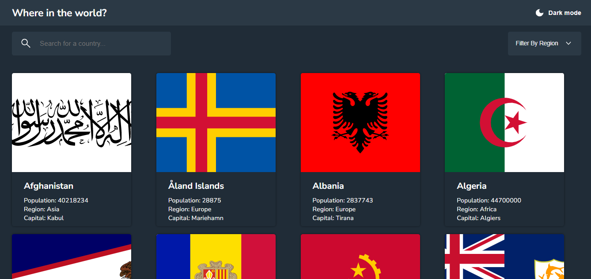

# REST Countries API with color theme switcher

## Conteúdo
- [Sobre](#sobre)
- [Link](#link)
- [Tecnologias](#tecnologias)
- [Autor](#autor)

## Sobre
Esta é uma solução para o desafio [REST Countries API with color theme switcher](https://www.frontendmentor.io/challenges/rest-countries-api-with-color-theme-switcher-5cacc469fec04111f7b848ca) no Frontend Mentor, responsivo para grande parte dos dispositivos. Este projeto é um site que apresenta uma lista de todos os países do mundo, com seus respectivos nomes, bandeiras, população, região e capitais. Ao clicar em um país, o site exibe uma página com diversas informações sobre ele, como população, nome nativo, moeda, idioma, região, sub-região, capital e domínio web. O site também permite filtrar os países por região ou por nome, facilitando a busca por um país específico. O objetivo deste projeto é fornecer uma forma simples e interativa de conhecer mais sobre os países do mundo.

## Link
- Site - https://rest-countries-api-theme-switcher.netlify.app

## Tecnologias
- HTML
- CSS
- Javascript

## Autor
- Site - https://sanches-spoladore.netlify.app
- Perfil no Frontend Mentor - https://www.frontendmentor.io/profile/sanchesspoladore